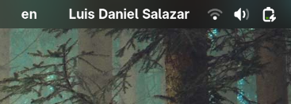
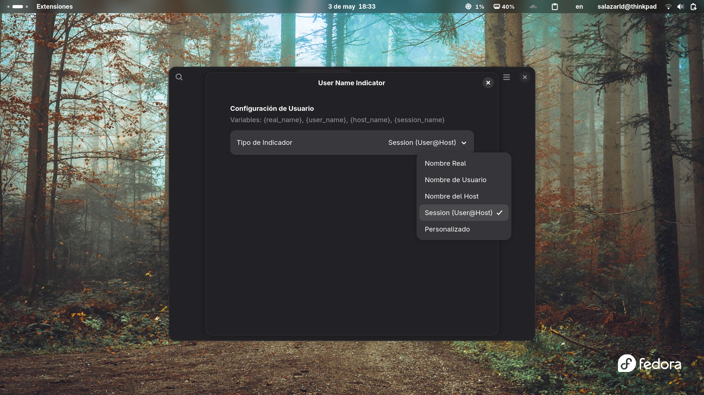
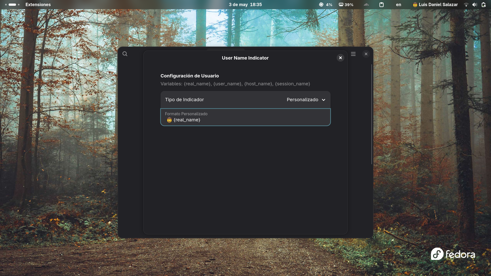

# User Name Indicator
---

A GNOME Shell extension that adds a customizable user, host, or session indicator to the Quick Settings area of the top panel.



## Features
---

- **Multiple Indicator Types**: Choose what information to display:
  - Real Name (`GLib.get_real_name`)
  - User Name (`GLib.get_user_name`)
  - Host Name (`GLib.get_host_name`)
  - Session Info (`user@host`)
  - **Custom Format**: Create your own display format using variables:
  - `{real_name}`
  - `{user_name}`
  - `{host_name}`
  - `{session_name}` (defaults to `user@host`)
- **Quick Settings Integration**: Neatly placed at the start of the Quick Settings indicators.

## Screenshots
---

| Preferences Window | Custom Format |
| :---: | :---: |
|  |  |
| *Indicator selection* | *Custom format in action* |

## Installation
---

### Manual Installation

1. Download or clone the repository.
2. Move the folder to your local extensions directory:
   ```bash
   cp -r usernameindicator@winandronux.github.com ~/.local/share/gnome-shell/extensions/
   ```
3. Compile the GSettings schema:
   ```bash
   glib-compile-schemas ~/.local/share/gnome-shell/extensions/usernameindicator@winandronux.github.com/schemas/
   ```
4. Restart GNOME Shell:
   - **X11**: Press `Alt + F2`, type `r`, and press `Enter`.
   - **Wayland**: Log out and log back in.
5. Enable the extension using **GNOME Extensions** or via CLI:
   ```bash
   gnome-extensions enable usernameindicator@winandronux.github.com
   ```

## License
---
This project is licensed under the MIT License.
